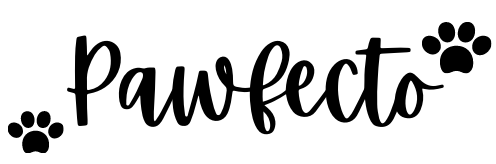
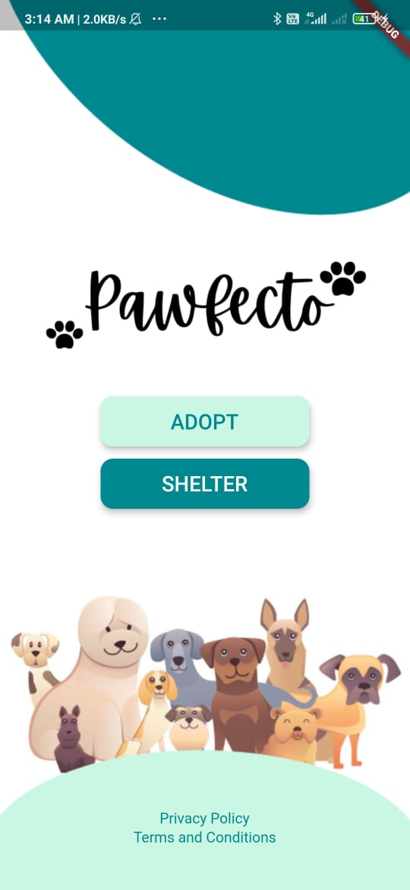

<h1>Pet Adoption App: Pawfecto</h1>

 
<h3>Problem</h3>

Millions of animals are homeless on the streets and are brought to shelters on a daily basis.

Animal shelters play a vital role in our communities as they continuously work to reunite pets with their owners, shelter those in need, and find new homes for animals that are lost, without a permanent home or for those animals that, for our own security, should not be roaming our streets.

Recent research shows that people who prefer to adopt are more prone to surf through the internet before actually visiting the shelter. Hence, it is a necessity to provide a convenient way for the users and shelters to interact. In today’s world, people prefer to buy pets from stores over adoption, as the health of the pet is considered to be a major issue.

<h3>Solution</h3>

The main purpose of our app is to find the right match between potential adopters and pets, such that the adopters find a pet that fits their lifestyle. Through this app, we try to bridge the gap between purchase and adoption, and interaction before visits.

 

 
<h3>Getting Started</h3>

Clone this repository via Android Studio: git clone https://github.com/pavithrahareddy/pawfecto.git

Install all the dependencies

Run the app on a physical device / emulator / IOS simulator
